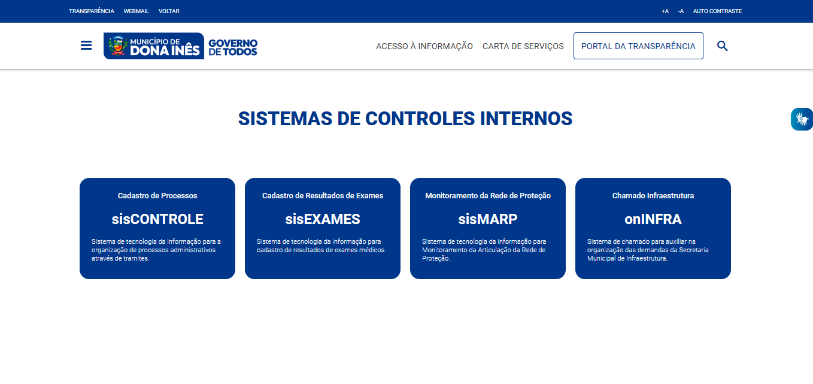

# Sistemas da Prefeitura Municipal de Dona Inês

<!---Esses são exemplos. Veja https://shields.io para outras pessoas ou para personalizar este conjunto de escudos. Você pode querer incluir dependências, status do projeto e informações de licença aqui--->

<!-- 


 -->



> Homepage simples que tem como objetivo organizar e facilitar o acesso aos sistemas de controles internos do Município de Dona Inês PB.

### Ajustes e melhorias

O projeto ainda está em desenvolvimento e as próximas atualizações serão voltadas nas seguintes tarefas:

- [x] Barra superior fixa ao rolar
- [x] Responsividade para telas menores
- [x] Estilização do menu principal
- [x] Funcionalidade de abrir e fechar menu principal 
<!-- - [ ] Tarefa 5 -->

## 💻 Pré-requisitos

Antes de começar, verifique se você atendeu aos seguintes requisitos:
<!---Estes são apenas requisitos de exemplo. Adicionar, duplicar ou remover conforme necessário--->
* Você instalou a versão mais recente de `Node v18.13.0 / Vite ^4.0.0 `
* Você tem uma máquina `^Windows / Linux / Mac`.
<!-- * Você leu `<guia / link / documentação_relacionada_ao_projeto>`. -->

## 🚀 Instalando pmdonaines-sistemas

Para instalar o pmdonaines-sistemas, siga estas etapas:

Windows Linux e macOS:
```
git clone https://github.com/marcosferreira/pmdonaines-sistemas
```

## ☕ Usando pmdonaines-sistemas

Para usar pmdonaines-sistemas, siga estas etapas:

```
cd pmdonaines-sistemas
npm install
npm run dev
```

Adicione comandos de execução e exemplos que você acha que os usuários acharão úteis. Fornece uma referência de opções para pontos de bônus!

## 📫 Contribuindo para pmdonaines-sistemas
<!---Se o seu README for longo ou se você tiver algum processo ou etapas específicas que deseja que os contribuidores sigam, considere a criação de um arquivo CONTRIBUTING.md separado--->
Para contribuir com pmdonaines-sistemas, siga estas etapas:

1. Bifurque este repositório.
2. Crie um branch: `git checkout -b <nome_branch>`.
3. Faça suas alterações e confirme-as: `git commit -m '<mensagem_commit>'`
4. Envie para o branch original: `git push origin pmdonaines-sistemas / <local>`
5. Crie a solicitação de pull.

Como alternativa, consulte a documentação do GitHub em [como criar uma solicitação pull](https://help.github.com/en/github/collaborating-with-issues-and-pull-requests/creating-a-pull-request).

<!-- ## 🤝 Colaboradores

Agradecemos às seguintes pessoas que contribuíram para este projeto:

<table>
  <tr>
    <td align="center">
      <a href="#">
        <br>
        <sub>
          <b>Marcos Ferreira</b>
        </sub>
      </a>
    </td>
  </tr>
</table> -->

<!-- 
## 😄 Seja um dos contribuidores<br>

Quer fazer parte desse projeto? Clique [AQUI](CONTRIBUTING.md) e leia como contribuir.

## 📝 Licença

Esse projeto está sob licença. Veja o arquivo [LICENÇA](LICENSE.md) para mais detalhes.

[⬆ Voltar ao topo](#nome-do-projeto)<br> -->
